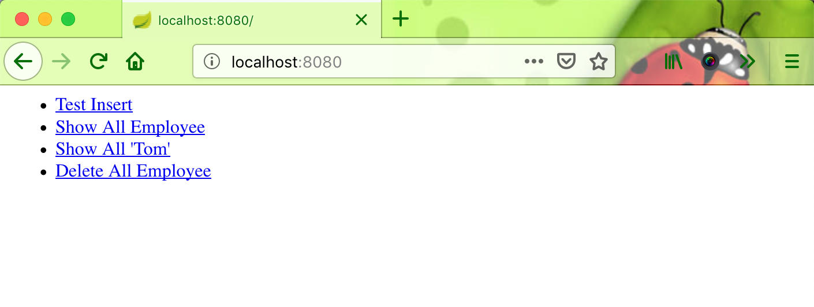
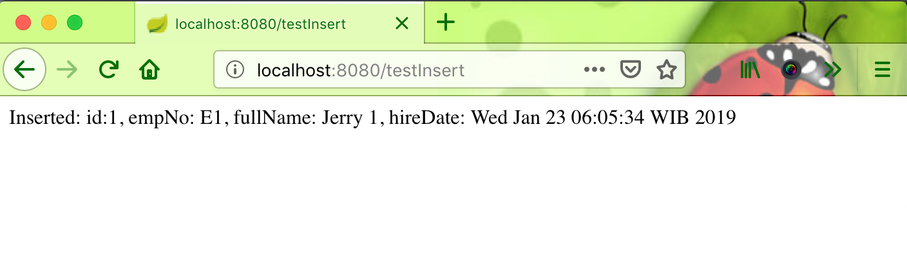

# springboot-mongodb-example

The Spring Data MongoDB will automatically create methods to implement the abstract methods of Interface. Below is a list of supported keywords for data query methods:

|Keyword| 	Sample| 	Logical result|
|---|---|---|
|GreaterThan| 	findByAgeGreaterThan(int age)| 	{"age" : {"$gt" : age}}|
|LessThan 	|findByAgeLessThan(int age) 	|{"age" : {"$lt" : age}}|
|Between 	|findByAgeBetween(int from, int to)| 	{"age" : {"$gt" : from, "$lt" : to}}|
|IsNotNull, NotNull| 	findByFirstnameNotNull()| 	{"age" : {"$ne" : null}}|
|IsNull, Null 	|findByFirstnameNull() 	|{"age" : null}|
|Like 	|findByFirstnameLike(String name)| 	{"age" : age} ( age as regex)|
|(No keyword)| 	findByFirstname(String name)| 	{"age" : name}|
|Not 	|findByFirstnameNot(String name) 	|{"age" : {"$ne" : name}}|
|Near 	|findByLocationNear(Point point) 	|{"location" : {"$near" : [x,y]}}|
|Within |	findByLocationWithin(Circle circle)| 	{"location" : {"$within" : {"$center" : [ [x, y], distance]}}}|
|Within |	findByLocationWithin(Box box) 	|{"location" : {"$within" : {"$box" : [ [x1, y1], x2, y2]}}}|

#### Things to do to run this project :
1. Clone this repo by this command : `git clone https://github.com/hendisantika/springboot-mongodb-example.git`.
2. Go to its folder `cd springboot-mongodb-example`
3. Run the app by this command : `mvn clean spring-boot:run`

#### Screen shot

Home Page

Insert Data

List Data

